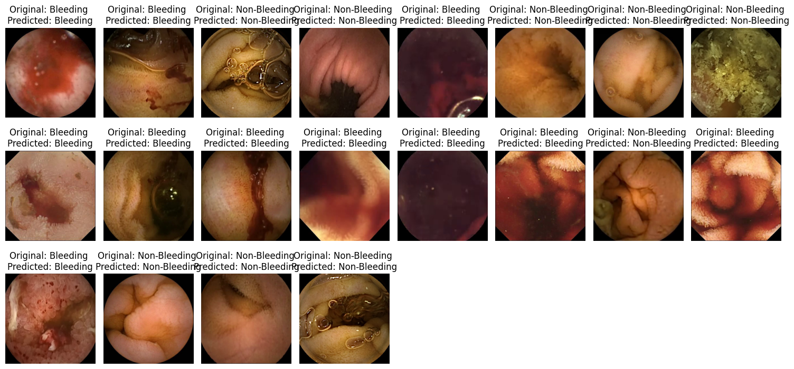
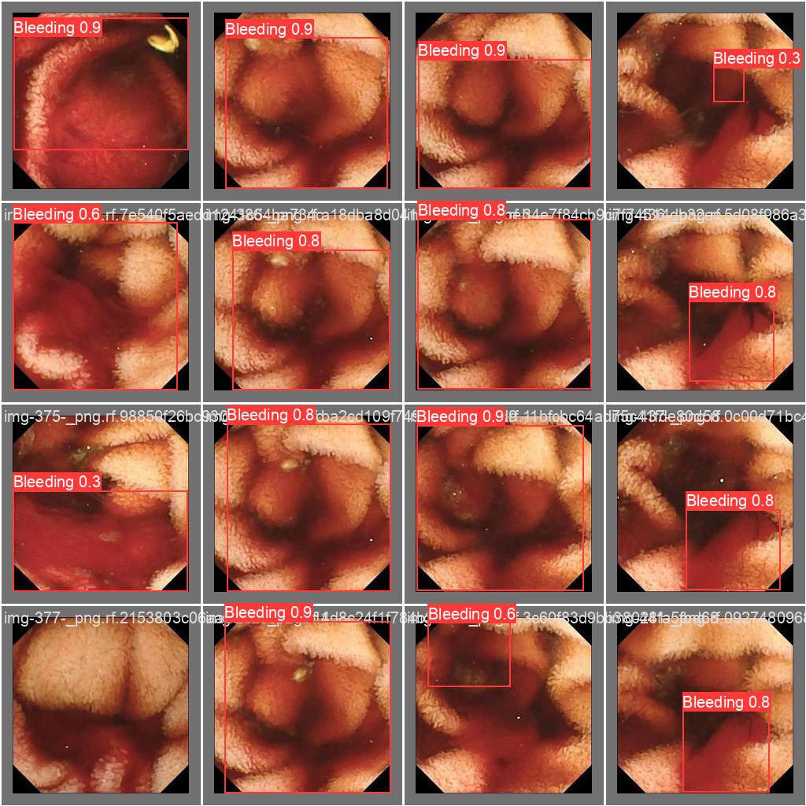
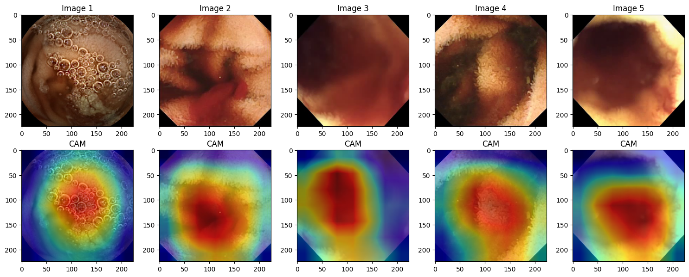
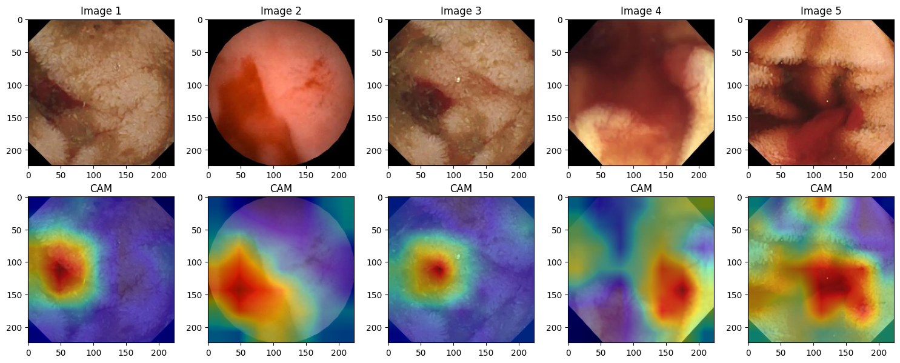
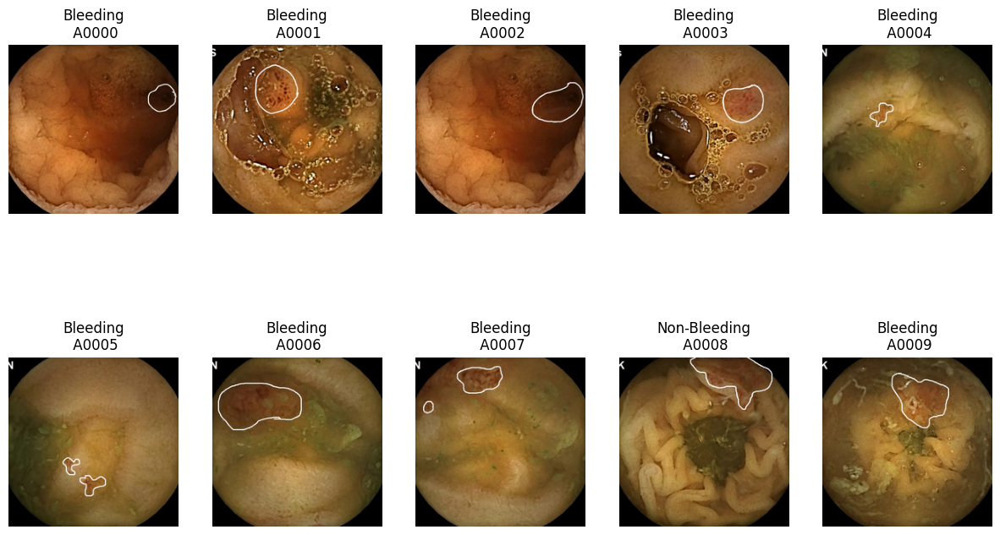
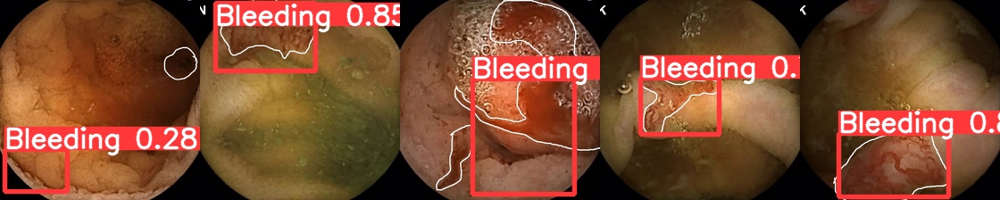
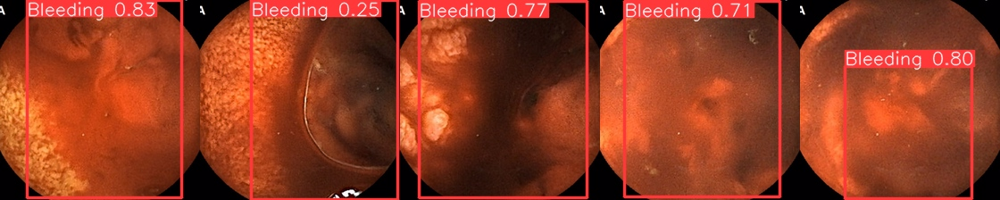

# Auto-WCEBleedGen Challenge
Automatic Detection and Classification of Bleeding and Non-Bleeding frames in Wireless Capsule Endoscopy

Note : can download trained models from latest releases

## Table of Contents
- [Introduction](#auto-wcebleedgen-challenge)
- [Evaluation Results](#evaluation-results)
  - [Classification Report](#classification-report)
  - [Detection](#detection)
- [Validation Dataset Results](#validation-dataset-results)
  - [Classification ](#classification-screenshots)
  - [Detection ](#detection-screenshots)
  - [Interpretability Plots](#interpretability-plots)
- [Testing Dataset Results](#testing-dataset-results)
  - [Test Dataset 1](#dataset-1)
    - [Classification](#classification)
    - [Detection ](#detection-screenshots)
  - [Test Dataset 2](#dataset-2)
    - [Classification](#classification)
    - [Detection](#detection-screenshots)

## Introduction
This README provides an overview of the Auto-WCEBleedGen Challenge project, which focuses on the automatic detection and classification of bleeding and non-bleeding frames in wireless capsule endoscopy.

## Evaluation Results
### Classification Report
These results are evaluated using validation data.

|                | Precision | Recall | F1-Score | Support |
|----------------|-----------|--------|----------|---------|
| Bleeding       | 1.00      | 1.00   | 1.00     | 258     |
| Non-Bleeding   | 1.00      | 1.00   | 1.00     | 265     |
| Accuracy       |           |        | 1.00     | 523     |
| Macro Avg      | 1.00      | 1.00   | 1.00     | 523     |
| Weighted Avg   | 1.00      | 1.00   | 1.00     | 523     |

### Detection
| Metric                  | Value |
|-------------------------|-------|
| Average Precision       | 0.81742 |
| Mean Average Precision  | 0.57529 |
| Intersection over Union | 0.67174 |

## Validation Dataset Results
### Classification Screenshots

### Detection Screenshots

### Interpretability Plots

## Testing Dataset Results
### Test Dataset 1
#### Classification

#### Detection 

### Test Dataset 2
#### Classification

#### Detection 

