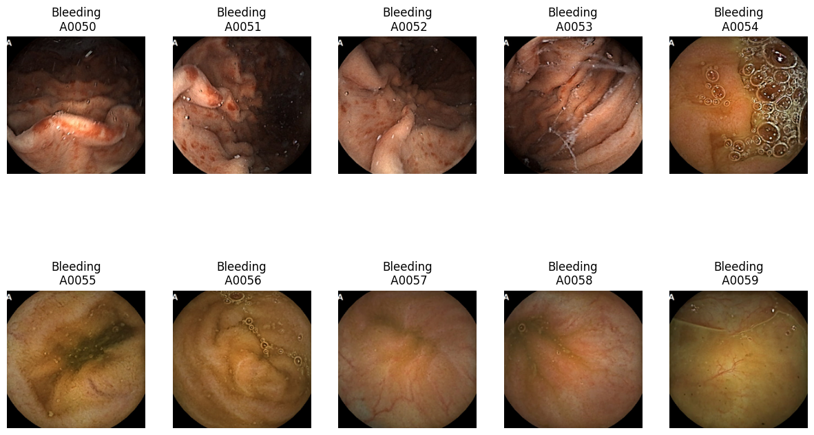

# Auto-WCEBleedGen Challenge
 Automatic Detection and Classification of Bleeding and Non-Bleeding frames in Wireless Capsule Endoscopy

## Evaluation Results

### Classification Report
These results are evaluated using validation data.

|                | Precision | Recall | F1-Score | Support |
|----------------|-----------|--------|----------|---------|
| Bleeding       | 1.00      | 1.00   | 1.00     | 258     |
| Non-Bleeding   | 1.00      | 1.00   | 1.00     | 265     |
| Accuracy       |           |        | 1.00     | 523     |
| Macro Avg      | 1.00      | 1.00   | 1.00     | 523     |
| Weighted Avg   | 1.00      | 1.00   | 1.00     | 523     |

### Detection 

| Metric                  | Value |
|-------------------------|-------|
| Average Precision       |0.81742|
| Mean Average Precision  |0.57529|
| Intersection over Union |0.67174|

## Validation Dataset Results

### Classification Screenshots

### Detection Screenshots

### Interpretability Plots

## Testing Dataset Results

### Dataset 1

#### Classification
Predictions

#### Detection Screenshots  

### Dataset 2

#### Classification
Predictions

#### Detection Screenshots  

